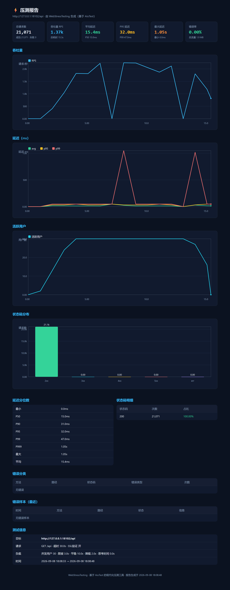

# ⚡ WebStressTesting — 基于 AioTest 的现代化网站压测工具

> 输入一个目标网址（域名 / URL），一条命令对网站发起高并发压测：
> 实时终端仪表盘、离线图表报告、机器可读数据，一键全都有。

[**中文**](./README.md) | [**English**](./README_EN.md)




---

## 目录

- [项目简介](#项目简介)
- [特性](#特性)
- [安装](#安装)
- [快速开始](#快速开始)
- [命令行参考](#命令行参考)
- [负载模型](#负载模型)
- [请求配置](#请求配置)
- [报告说明](#报告说明)
- [与 AioTest 的关系](#与-aiotest-的关系)
- [Windows 高并发](#windows-高并发)
- [常见问题 FAQ](#常见问题-faq)
- [自检](#自检)
- [贡献](#贡献)
- [许可证与免责声明](#许可证与免责声明)

## 项目简介

WebStressTesting 是一款**现代化的网站压测（负载测试）工具**：只要给出一个网站域名或 URL，
它就会用异步的高并发请求持续“压打”目标，实时展示 RPS、延迟分位数、成功率等指标，
并在结束后自动产出可分享的 HTML 图表报告与 JSON / CSV 数据文件，方便留存、对比与接入 CI。

底层基于 **AioTest**（asyncio 负载测试框架）：动态生成 `HttpUser` 与 `LoadUserShape`，
交给 AioTest 的 `LocalRunner` 在进程内执行，同时订阅其 `request_metrics` 事件做进程内指标聚合。

## 特性

- **一条命令压测任意网站**：`WebStressTesting https://example.com -u 100 -d 60`
- **三段式负载曲线**：爬坡 ramp-up → 平稳 steady → 降载 ramp-down（自动 / 手动配置）
- **实时终端仪表盘**：RPS、延迟分位数、成功率、状态码、吞吐、Sparkline
- **连通性预检**：压测前检查 DNS 解析、HTTP 状态、Server、响应耗时
- **灵活的请求配置**：任意 HTTP 方法、请求头、查询参数、JSON / 文件请求体、超时、跳过 SSL 校验
- **精确停止**：`--max-requests` 提前结束，超发控制在并发数以内；`-d 0` 纯请求数模式
- **离线 HTML 报表**：内联 SVG 图表（吞吐 / 延迟 / 用户 / 状态码），无需 CDN，可分享
- **机器可读产物**：`report.json` / `series.csv` / `failures.csv` / `config.json`
- **Prometheus 指标端点**：`--prometheus-port 8089` 暴露 AioTest 原生 `/metrics`
- **Windows 高并发**：>256 用户自动切换 Proactor（IOCP）事件循环，突破 `select()` 文件描述符上限
- **内置代理池 ProxyPool**：自建“抓取 → 校验 → 存储(MySQL) → API”闭环，只保留有效代理；压测支持**一个用户一个 IP**（粘性代理、故障自动换绑）

## 安装

```bash
# 方式一：安装依赖后直接以模块方式运行
pip install -r requirements.txt
python -m web_stress_testing --help

# 方式二：可编辑安装，获得 WebStressTesting 命令
pip install -e .
WebStressTesting --help
```

> 要求：Python 3.10+。Windows 下推荐使用 **Windows Terminal / PowerShell** 以获得最佳终端显示。
> 联网安装依赖：`pip install aiotest rich`。

## 快速开始

```bash
# 压测 example.com：100 并发用户，平稳 60 秒（爬坡 / 降载自动）
python -m web_stress_testing https://example.com -u 100 -d 60
# 安装后也可以直接用命令：
WebStressTesting https://example.com -u 100 -d 60

# POST + JSON 请求体 + 自定义请求头 + 查询参数
WebStressTesting --url https://api.example.com/login -X POST \
    --body '{"user":"bob","pwd":"x"}' --content-type application/json \
    --headers "Authorization: Bearer xxx" --param "v=1" -u 50 -d 30

# 320 并发、120 秒、显式爬坡 30s、最多 5 万请求提前结束
WebStressTesting https://example.com -u 320 -d 120 --ramp-up 30 --max-requests 50000

# 自签名证书站点
WebStressTesting https://selfsigned.example.com -u 20 -d 30 --no-verify-ssl

# 只给域名，自动补 https://
WebStressTesting example.com -u 20 -d 30
```

运行结束后输出报告路径：

```
✔ 报告已保存
  reports\example.com_20260908_121500\report.html
  reports\example.com_20260908_121500\report.json
  ...
```

打开 `report.html` 即可查看带图表的完整压测报告（上图即示例）。

## 命令行参考

| 参数 | 说明 | 默认 |
|---|---|---|
| `target` / `--url` | 目标网址（域名或完整 URL，自动补 https://） | 必填 |
| `-u, --users` | 并发用户数（峰值） | 10 |
| `-d, --duration` | 平稳期持续时间（秒） | 60 |
| `--ramp-up` | 爬坡时间（秒） | 按总时长自动 |
| `--ramp-down` | 降载时间（秒） | 按总时长自动 |
| `--spawn-rate` | 用户启动速率（个/秒） | users / ramp_up |
| `--think-time` | 每个请求之间的思考时间（秒） | 0 |
| `--max-requests` | 达到该请求数后提前结束 | 无 |
| `-X, --method` | HTTP 方法 GET/POST/PUT/DELETE... | GET |
| `--path` | 请求路径（覆盖 URL 中的路径） | URL 路径 |
| `--headers` | 请求头：JSON 对象或 `K: V, K2: V2` | 无 |
| `--param K=V` | 查询参数（可重复传入） | 无 |
| `--body` | 请求体：JSON 字符串或 `@文件路径` | 无 |
| `--content-type` | Content-Type（配合 --body） | 无 |
| `--timeout` | 请求超时（秒） | 30 |
| `--no-verify-ssl` | 跳过 SSL 证书校验（自签名证书） | 校验 |
| `--preflight` / `--no-preflight` | 连通性预检 | 开启 |
| `--no-dashboard` | 关闭实时仪表盘 | 开启 |
| `-q, --quiet` | 安静模式 | 关闭 |
| `--report-dir` | 报告输出目录 | `./reports/<name>_<时间戳>` |
| `--name` | 本次测试名称 | 目标域名 |
| `--prometheus-port` | AioTest 指标端口（0=随机） | 0 |
| `--proxy` | 单代理，如 `ip:port` 或 `http://ip:port` | 无 |
| `--proxy-file` | 代理列表文件（每行一个） | 无 |
| `--proxy-api` | 代理池服务地址（如 `http://127.0.0.1:5010`） | 无 |
| `--proxy-sticky` / `--no-proxy-sticky` | 每个用户固定一个代理 IP（粘性） | 开 |
| `--loop-policy` | Windows 事件循环：`auto`/`selector`/`proactor` | auto |
| `--loglevel` | AioTest 日志级别（写入 aiotest.log） | WARNING |

## 负载模型

默认按“爬坡 → 平稳 → 降载”三段执行：

```
用户数
峰值 ┤        ┌───────────────┐
     │       /                 \
     │      /                   \
   0 ┤─────┴─────────────────────┴──▶ 时间
      ramp-up       steady      ramp-down
```

- **ramp-up**：用户从 0 平滑增加到峰值（默认约为总时长的 15%，可 `--ramp-up` 指定）
- **steady**：以峰值持续 `--duration` 秒
- **ramp-down**：用户平滑降载（默认约为总时长的 10%）
- **纯请求数模式**：`-d 0 --max-requests N` 时不再按时间，保持满负载直到发满 N 个请求
- **提前退出**：`--max-requests` 与时长条件“谁先到谁结束”

## 报告说明

每次运行在报告目录下生成：

| 文件 | 内容 |
|---|---|
| `report.html` | 图表化压测报告（自包含、离线可看、可分享） |
| `report.json` | 全部汇总指标 + 每秒时间序列 + 错误样本 |
| `series.csv` | 每秒一行：RPS、延迟分位、用户数、失败数、吞吐 |
| `failures.csv` | 错误详情（状态码、错误类型、信息，最多 2000 条） |
| `config.json` | 本次测试的完整配置回放 |
| `aiotest.log` | AioTest 框架日志 |

指标定义：

- **延迟分位数**：全部请求耗时的 min / avg / p50 / p90 / p95 / p99 / p999 / max；
  由 1ms 粒度直方图计算，内存占用恒定（适合长时间高 RPS）。
- **RPS / 吞吐**：每秒请求数 / 每秒响应字节数。
- **错误**：4xx / 5xx、连接错误、超时等均计为失败，并按（路径, 状态码, 错误类型）分组展示。

## 与 AioTest 的关系

- WebStressTesting 在进程内直接调用 AioTest：`RunnerFactory.create("local", ...)` +
  `runner.start()` + `runner.run_until_complete()`，不额外启动子进程。
- 用户行为由动态生成的 `HttpUser` 子类提供（任务方法 `test_pressure`），
  负载曲线由动态生成的 `LoadUserShape` 子类提供（`tick()` 返回目标用户数与速率）。
- 指标订阅 AioTest 的 `request_metrics` 事件，与 AioTest 自带的 Prometheus 收集并行。
- 想用 AioTest 官方风格手写场景？参考 [`examples/website_pressure.py`](examples/website_pressure.py)：

```bash
pip install aiotest
python -m aiotest -f examples/website_pressure.py -H https://example.com
```

## Windows 高并发

`select()` 事件循环在 Windows 上受文件描述符上限影响（约 512 个 socket），
500 并发用户可能报错：

```
ValueError: too many file descriptors in select()
```

WebStressTesting 的处理方式：

- 用户数 **> 256 时自动切换为 Proactor（IOCP）** 事件循环：无 fd 上限，可支撑数千并发连接；
- 可通过 `--loop-policy selector|proactor` 手动指定；
- 若强制 `selector` 且并发较高，会给出警告提示。

## 常见问题 FAQ

**Q: 报 `too many file descriptors in select()`？**
A: Windows select() 的 fd 上限问题。使用 v0.2.0+，>256 用户会自动切换到 Proactor；
也可显式加 `--loop-policy proactor`。

**Q: P99 延迟很高 / 成功率下降？**
A: 通常是目标站点在高并发下的真实瓶颈（带宽、连接数、CPU、限流）。
建议逐步降低 `-u`（如 500 → 300 → 200）找出吞吐拐点，用 `report.html` 的曲线对比。

**Q: 终端里中文乱码？**
A: 请使用 Windows Terminal / PowerShell（或把控制台代码页切到 UTF-8）；工具内部已按 UTF-8 输出。

**Q: 4xx / 5xx 会怎样？**
A: 均计为失败（错误率），并记录到 `failures.csv`；4xx（如 404）不一定代表系统故障，
可结合目标业务定义解读。

**Q: 压测会重试吗？**
A: 不会。压测模式下 `max_retries=0`，每个请求只发一次，避免重试扭曲指标。

## 自检

```bash
python scripts/self_check.py            # 主流程
python scripts/self_check_proxypool.py  # 代理池端到端（本地代理 + 一用户一IP）
```

详见 [`docs/PROXY_POOL.md`](docs/PROXY_POOL.md)（内置代理池：服务、API、校验机制、压测接入）。

## 原自检

```bash
python scripts/self_check.py
```

脚本会启动本地 mock 服务器、完整跑一遍压测并校验报告产物与指标合理性（CI 可用）。

## 贡献

欢迎 Issue 与 PR：功能建议、Bug 报告、文档改进、更多压测模式（阶段式、阶梯式、每秒请求数模式等）。

## 许可证与免责声明

- 本项目基于 [MIT License](./LICENSE)。
- **只对你有权测试的系统发起压测**；对公网/生产域名压测前请确认已获得授权，
  高并发可能触发目标限流、封禁或影响线上服务。
